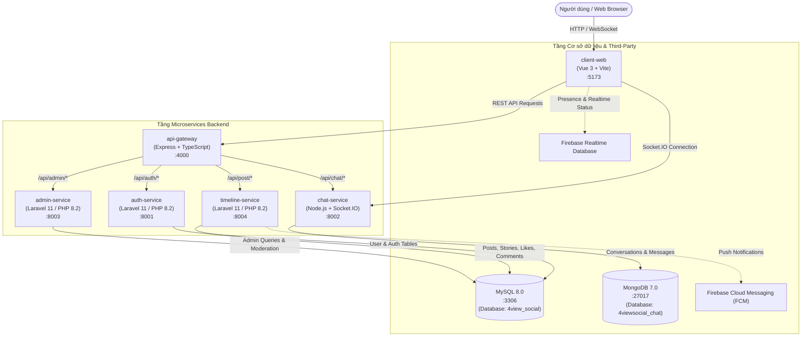

# 📘 TỔNG HỢP TOÀN DIỆN HỆ THỐNG MẠNG XÃ HỘI 4VIEWSSOCIAL

Tài liệu thiết kế kiến trúc, công nghệ, luồng nghiệp vụ và hướng dẫn vận hành toàn bộ hệ thống mạng xã hội **4ViewsSocial**.

---

## 1. 🌐 Tổng quan dự án

**4ViewsSocial** là nền tảng mạng xã hội hiện đại được xây dựng theo mô hình **Kiến trúc Vi dịch vụ (Microservices Architecture)**. Hệ thống phân tách độc lập các khối chức năng nghiệp vụ nhằm đảm bảo tính chịu tải cao, khả năng mở rộng linh hoạt (scalability), dễ bảo trì và mở rộng tính năng mới.

---

## 2. 🏛️ Sơ đồ Kiến trúc Hệ thống (Architecture Diagram)



---

## 3. 📦 Danh mục 6 Microservices chi tiết

### 1. `client-web` (Web Frontend Client)
- **Công nghệ**: Vue 3 (Composition API), Vite, Pinia Store, Bootstrap 5, Bootstrap Icons, Chart.js.
- **Port**: `5173`
- **Trách nhiệm**:
  - Giao diện người dùng: Bảng tin (News Feed), Stories 24h, Trang cá nhân, Khám phá (Explore), Khung chat thời gian thực.
  - Cổng quản trị Admin: Dashboard thống kê biểu đồ, danh sách quản lý tài khoản, bài viết, stories, bình luận, báo cáo vi phạm.
  - Quản lý phiên và trạng thái người dùng (Pinia Store `auth.store.js`), tự động gắn Bearer Token qua Axios Interceptors.
  - Tích hợp Firebase SDK: Lắng nghe FCM Notifications và theo dõi trạng thái Online/Offline thời gian thực.

---

### 2. `api-gateway` (Cổng điều phối API tập trung)
- **Công nghệ**: Node.js, Express.js, TypeScript, `http-proxy-middleware`, CORS, Morgan Logger.
- **Port**: `4000`
- **Trách nhiệm**:
  - Điểm vào duy nhất (Single Entry Point) cho toàn bộ request từ Client.
  - Định tuyến (Routing & Reverse Proxy) tới các service nội bộ tương ứng.
  - Quản lý cấu hình CORS tập trung, ghi log request/response và xử lý mã lỗi toàn cục.
  - Bảng định tuyến:
    - `/api/auth/*` ➔ `auth-service:8001`
    - `/api/post/*` ➔ `timeline-service:8004`
    - `/api/chat/*` ➔ `chat-service:8002`
    - `/api/admin/*` ➔ `admin-service:8003`

---

### 3. `auth-service` (Dịch vụ Xác thực & Người dùng)
- **Công nghệ**: Laravel 11, PHP 8.2, Laravel Passport (JWT), Google Client API, Mail Service.
- **Port**: `8001`
- **Cơ sở dữ liệu**: MySQL (`users`, `oauth_*`)
- **Trách nhiệm**:
  - Đăng ký tài khoản mới, mã hóa mật khẩu (`bcrypt`), gửi email xác nhận.
  - Đăng nhập hệ thống bằng email/mật khẩu, cấp phát JWT Access Token & Refresh Token.
  - Xác thực và liên kết đăng nhập nhanh bằng Google OAuth (Google ID Token).
  - Đăng xuất và thu hồi hiệu lực của Access Token.

---

### 4. `timeline-service` (Dịch vụ Bảng tin, Tương tác & Thông báo)
- **Công nghệ**: Laravel 11, PHP 8.2, Firebase Service (FCM).
- **Port**: `8004`
- **Cơ sở dữ liệu**: MySQL (`posts`, `stories`, `comments`, `likes`, `favourites`, `follows`, `notifications`)
- **Trách nhiệm**:
  - Quản lý bài viết: Đăng bài kèm media (ảnh/video), danh sách bảng tin News Feed, khám phá (Explore).
  - Quản lý Stories 24h: Đăng tin ngắn (ảnh/video), tự động hết hạn, thích và phản hồi story.
  - Tương tác xã hội: Like bài viết, bình luận phân cấp, lưu bài viết vào bộ sưu tập cá nhân.
  - Mối quan hệ: Theo dõi (Follow), hủy theo dõi, danh sách bạn bè gợi ý.
  - Hồ sơ: Xem & cập nhật thông tin cá nhân (Bio, Avatar), đổi mật khẩu.
  - Thông báo: Lưu thông báo và gửi Push Notification tức thì qua Firebase Cloud Messaging.

---

### 5. `chat-service` (Dịch vụ Nhắn tin Thời gian thực)
- **Công nghệ**: Node.js, Express.js, Socket.IO, Mongoose (MongoDB ODM).
- **Port**: `8002`
- **Cơ sở dữ liệu**: MongoDB (`conversations`, `messages`)
- **Trách nhiệm**:
  - Quản lý cuộc hội thoại chat: 1-1 (Private) và Chat nhóm (Group).
  - Lịch sử tin nhắn: Lưu trữ và phân trang tin nhắn tốc độ cao trên MongoDB.
  - Giao tiếp Realtime qua WebSockets: Gửi/nhận tin nhắn tức thì, sự kiện người dùng đang gõ (`typing`), trạng thái đã đọc (`seen`).
  - Hỗ trợ gửi tin nhắn đa phương tiện (Văn bản, Hình ảnh, Video, Tệp tin đính kèm).

---

### 6. `admin-service` (Dịch vụ Quản trị Hệ thống)
- **Công nghệ**: Laravel 11, PHP 8.2.
- **Port**: `8003`
- **Cơ sở dữ liệu**: MySQL
- **Trách nhiệm**:
  - Thống kê hệ thống: Tổng số người dùng, bài viết mới, stories đang hoạt động, biểu đồ tăng trưởng.
  - Kiểm duyệt tài khoản: Danh sách người dùng, khóa / kích hoạt trạng thái tài khoản vi phạm.
  - Kiểm duyệt nội dung: Tìm kiếm, xem chi tiết và xóa bài viết, story, bình luận vi phạm tiêu chuẩn cộng đồng.
  - Xử lý báo cáo: Xem danh sách báo cáo vi phạm từ người dùng và đưa ra quyết định xử lý.

---

## 4. 🔄 Luồng Nghiệp vụ Chính (Core Business Workflows)

### A. Luồng Đăng nhập / Đăng ký & Cấp Token
1. Client gửi thông tin đăng nhập hoặc Google ID Token qua `POST /api/auth/login` tới API Gateway.
2. Gateway chuyển tiếp yêu cầu tới `auth-service`.
3. `auth-service` xác thực mật khẩu (hoặc verify token với Google), truy vấn thông tin User trong MySQL.
4. Cấp JWT Access Token và trả về thông tin người dùng chuẩn hóa qua `UserResource`.
5. Client lưu token vào `localStorage` và tự động gắn vào Header cho mọi request sau đó.

### B. Luồng Đăng bài viết & Xem Bảng tin
1. Client gửi `multipart/form-data` tới `POST /api/post/add-post`.
2. Gateway chuyển tới `timeline-service`.
3. `CreatePostRequest` kiểm tra tính hợp lệ dữ liệu.
4. `PostService` xử lý lưu file media vào thư mục lưu trữ, tạo bản ghi trong MySQL.
5. `PostResource` định dạng dữ liệu trả về cho client hiển thị ngay lên News Feed.

### C. Luồng Nhắn tin Thời gian thực (Realtime Chat)
1. Khi mở ứng dụng, Client kết nối WebSocket tới `chat-service` qua Socket.IO.
2. Khi người dùng bấm vào một cuộc trò chuyện, Client gọi `POST /api/chat/get-messages` lấy 50 tin nhắn gần nhất từ MongoDB.
3. Khi bấm gửi tin nhắn:
   - Client phát sự kiện `send_message` qua Socket (hoặc gọi API `POST /api/chat/send-message`).
   - `MessageService` lưu tin nhắn vào MongoDB.
   - `SocketHandler` phát sóng (`broadcast`) tin nhắn tới phòng chat (`room`) của đối phương ngay lập tức.

---

## 5. 🗄️ Cấu trúc Cơ sở dữ liệu

### MySQL Database (`4view_social`)
| Tên bảng | Chức năng chính |
| :--- | :--- |
| `users` | Thông tin tài khoản, mật khẩu băm, email, họ tên, avatar, bio, device_token, trạng thái hoạt động |
| `posts` | Nội dung bài viết, đường dẫn media (ảnh/video), user_id tác giả, trạng thái riêng tư/công khai |
| `stories` | Tin 24h ngắn, đường dẫn media, thời gian đăng, thời gian hết hạn |
| `comments` | Nội dung bình luận, user_id, post_id, parent_id (hỗ trợ bình luận lồng nhau) |
| `like_posts` | Liên kết lượt thích giữa user và bài viết |
| `like_stories` | Liên kết lượt thích giữa user và story 24h |
| `favourites` | Danh sách bài viết được lưu trữ của từng người dùng |
| `follows` | Quan hệ theo dõi giữa `user_id` và `target_user_id` |
| `notifications`| Thông báo hệ thống (tiêu đề, nội dung, status WAIT/DONE, user_id) |
| `oauth_*` | Bảng quản lý tokens của Laravel Passport |

### MongoDB Database (`4viewsocial_chat`)
| Collection | Cấu trúc dữ liệu chính |
| :--- | :--- |
| `conversations` | `_id`, `members: [userId1, userId2]`, `type: 'private'\|'group'`, `name`, `last_message`, `updatedAt` |
| `messages` | `_id`, `conversation_id`, `sender_id`, `message`, `type: 'text'\|'image'\|'video'`, `file_url`, `seen_by`, `createdAt` |

---

## 6. 🚀 Hướng dẫn Cài đặt & Khởi chạy

### Cách 1: Khởi chạy bằng Docker Compose (Khuyên dùng)
Chỉ cần 1 câu lệnh duy nhất để build và chạy toàn bộ 6 service + MySQL + MongoDB:

```bash
docker compose up --build -d
```

- **Kiểm tra trạng thái containers**:
  ```bash
  docker compose ps
  ```
- **Dừng toàn bộ hệ thống**:
  ```bash
  docker compose down
  ```

---

### Cách 2: Khởi chạy thủ công bằng Script Python
1. Đảm bảo đã cài đặt MySQL (port 3306) và MongoDB (port 27017).
2. Tạo database `4view_social` trong MySQL.
3. Chạy lệnh cài đặt thư viện cho các service:
   - `auth-service`, `timeline-service`, `admin-service`: Chạy `composer install && php artisan migrate`
   - `api-gateway`, `chat-service`, `client-web`: Chạy `npm install`
4. Khởi chạy toàn bộ hệ thống chỉ với:
   ```bash
   python run_all.py
   ```

---

## 7. 🔒 Bảo mật & Quy ước Mã nguồn

- **Biến môi trường**: Không bao giờ commit file `.env` chứa API Key, mật khẩu database hay Firebase credentials. Sử dụng `.env.example` làm mẫu cấu hình.
- **Chuẩn hóa Code Documentation**: 100% các Controller, Service, Helper, API Module đều được gắn chú thích:
  - PHP: **DocBlock** (`@param`, `@return`, `@throws`).
  - TypeScript: **TSDoc**.
  - JavaScript / Vue: **JSDoc**.
- **Chuẩn hóa phản hồi API**: Toàn bộ phản hồi từ Laravel Services tuân theo format chuẩn JSON:
  ```json
  {
    "code": 200,
    "message": "Success",
    "data": { ... }
  }
  ```
